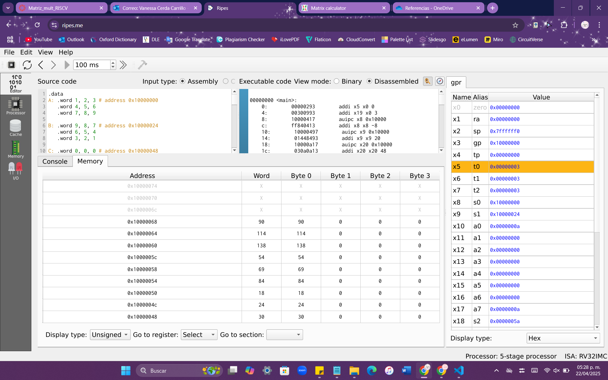

# Multiplicación de Matrices 3x3 en Ensamblador RISC-V

Este código implementa la multiplicación de dos matrices de 3x3 en lenguaje ensamblador para la arquitectura RISC-V 32I mediante el manejo de memoria, bucles anidados y operaciones aritméticas de bajo nivel.

## 🧱 Estructura

- Matrices A y B definidas en la sección `.data`.
- Multiplicación implementada en tres bucles anidados (i, j, k).
- La matriz resultado C se almacena en memoria y se imprime en consola (para simulador online `ripes.me`).

## 📸 Resultado

